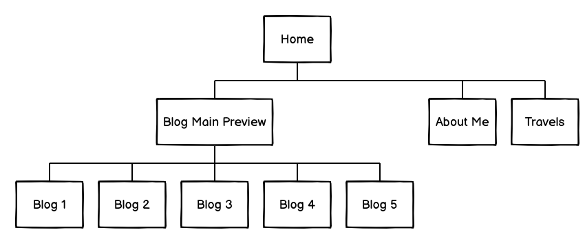
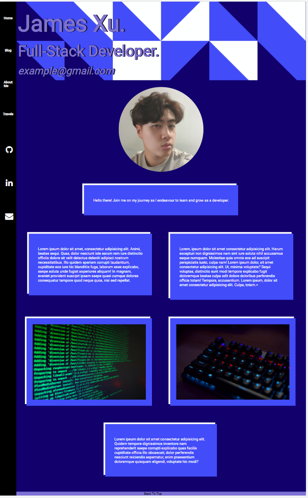
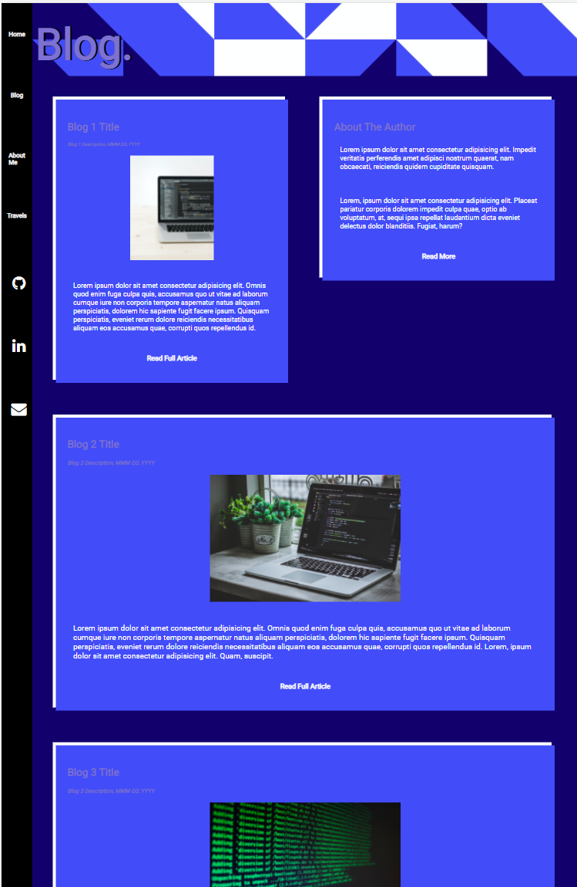
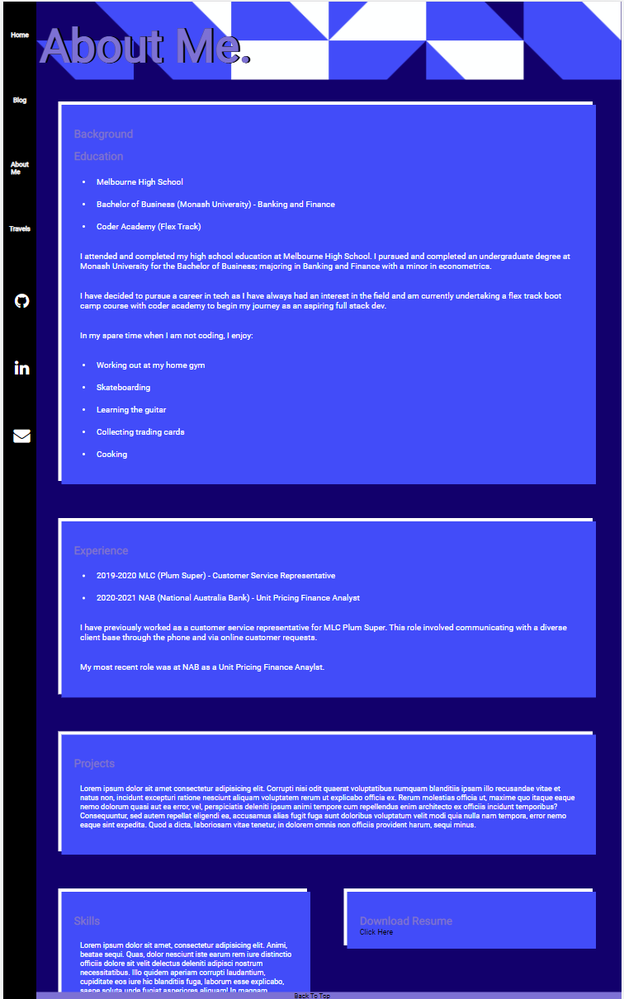
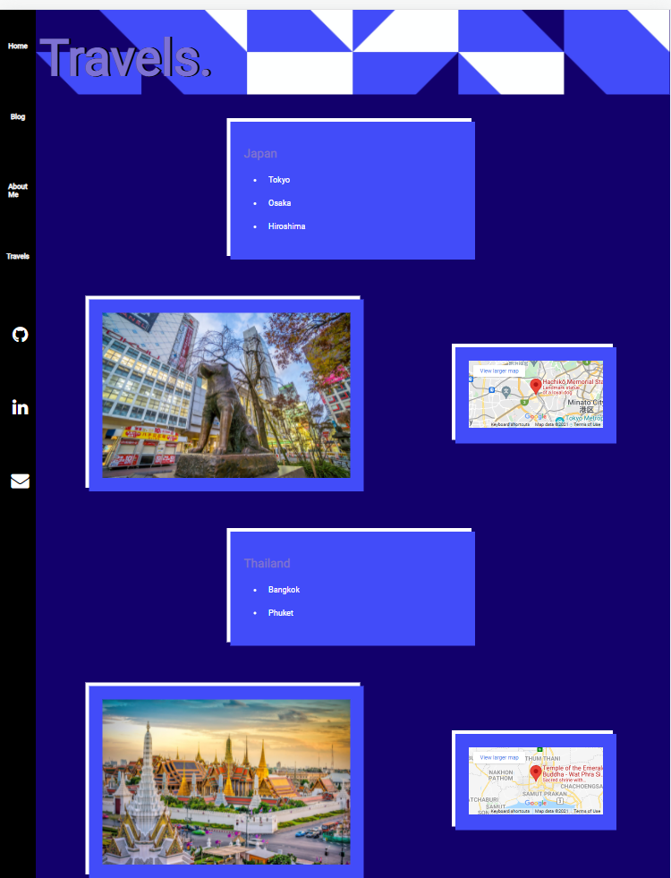
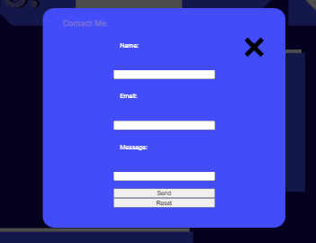

# My Portfolio

Link to my portfolio website: https://jamesxu-portfolio.netlify.app/
# Description
## Purpose

The purpose of this page is to display more information about myself including my experience, skills, interest and general background. 

Furthermore, the page itself serves to display my abilities regarding web-development.

## Functionality/Features

The page features re-used elements across the entire portfolio (header, footer, navbar, etc.).

Animations are also used in certain components such as the header and hover pseudoclasses.

The page was designed with a simple layout and to be easily navigatable/modified for future changes.

Accessibility was also accounted for in the inclusion of alt text and an easy to distinguise colour palette. Images also enlarge when hovered over.

## Sitemap

## Screenshots

## Target Audience
The targeted audience are potential employers/networkers or anyone who would like to know more about me.

## Tech Stack
The main languages used were HTML, CSS (SCSS). Website was deployed on netlify.